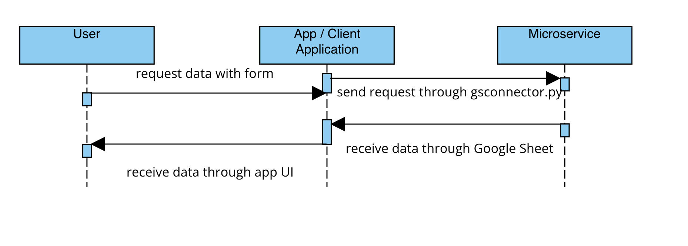

# README

## Microservice README
This microservice connects to a Google Sheet using the gspread library and reads data from two columns in the sheet. It then converts the data from string to float, performs statistical analysis on the data, and updates another sheet with the results.

## Usage
To use this microservice, you need to install the gspread library and have a Google Sheet with the required format.

1. Download the entire repo. Make sure to have `gsconnector.py` and `formulas.py` in the same working directory.
2. Install the gspread library by running `pip install gspread`.
3. Input data labels, data rows below the first row in this Google Sheet: https://docs.google.com/spreadsheets/d/1iGdPlx8LXma619GqyxkQMlU_-Q0l2x36LFYz7Tb94vw/edit#gid=0. The two data rows must have equal number of rows.
4. Run ``python3 gsconnector.py`` in the terminal.
5. Go to the result Google Sheet here: https://docs.google.com/spreadsheets/d/1u_s9FH4_FvHh2-qAYHbJ8vWTh0pTCm4LXh-h0nCcL_o/edit#gid=0. The results should be populated in various column headers.

## UML Diagram

## Dependencies
This microservice requires the following libraries:

- gspread
- numpy
- scipy

## License
This microservice is licensed under the MIT License.
